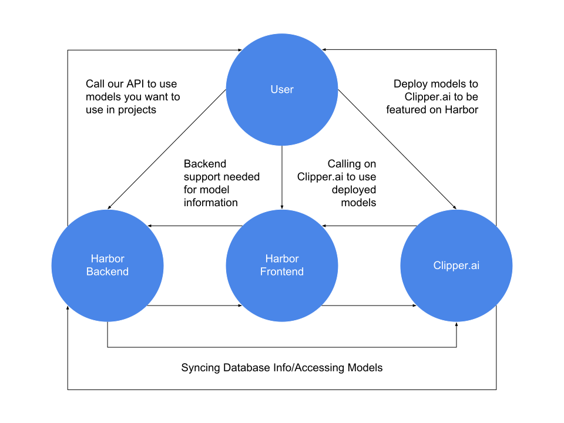
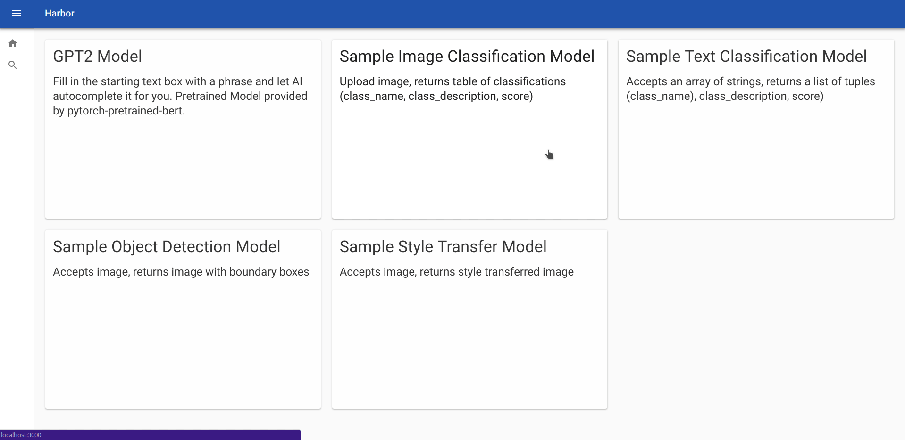
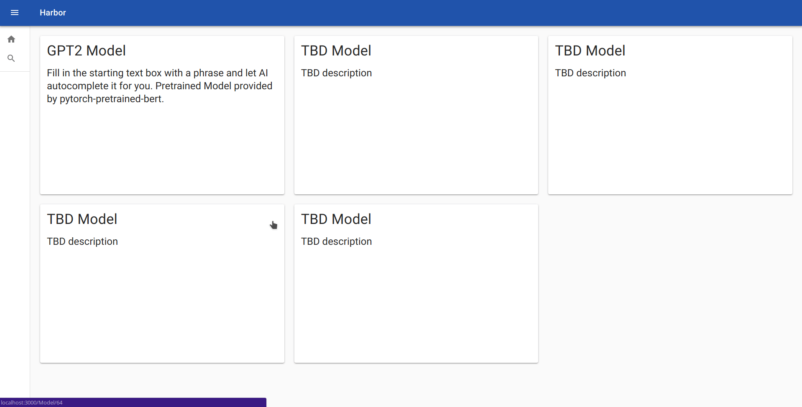

[Repository for Harbor](https://github.com/harbor-ml/harbor-frontend)

## Overview of Project:

This project will serve (at the moment) three purposes:
- Showcase models
- Demo models
- Serve as an API to use models in applications

We build upon Clipper.ai, which will help users deploy models. From there, we
will feature these deployed models on our site for others to try out and even
use in their own projects. A high-level description of the details of Harbor
is described below:

## v3:
(coming soon)

## v2:

## v1:

## Instructions:
- If you don't have node and/or npm installed, do that first.
- To set up locally, clone the repo and in terminal enter `npm install`
- If you run into any dependency errors, we can deal with them later (not a big deal)
- Enter `npm start` and then play around with it!

## Deployment Instruction:
- `sudo chmod 400 harbor-frontend-pem.txt`
- `ssh -i harbor-frontend.pem.txt ubuntu@{IP_ADDRESS}`
- `tmux`
- `git pull origin master` just in case you want to get updated code
- `npm run build`
- `serve -s build`
- Control+C for killing the server on tmux session

## Technology Used/Purposes:
- React: Dynamic website capabilities
- Redux: Allows state to be shared between components
  - Reducers/Actions in src/redux allow us to edit that overall state and also
    do HTTP requests in an organized manner
- Thunk: Middleware for Redux to handle actions (see src/redux)
- Material-UI: Solid CSS styler around React components

## Todos:
- Frontend
  - Define https requests and render in react webapp
  - Route to backend
  - Verify picture uploading success
- Backend
  - description of model, url for requests, params
  - Decide on what stack to use: mongo/express/mongoose or sql/django/flask

## Notes:
- Raymond is refactoring code within inputfields
  - Getting rid of unnecessary renderings within Components
  - Make model page dumb, Make inputfields smart
  - Call initialLoadWithSelection within inputfields
- Picture Uploading
  - Using either react-dropzone, react-image-uploader, or my own uploader
